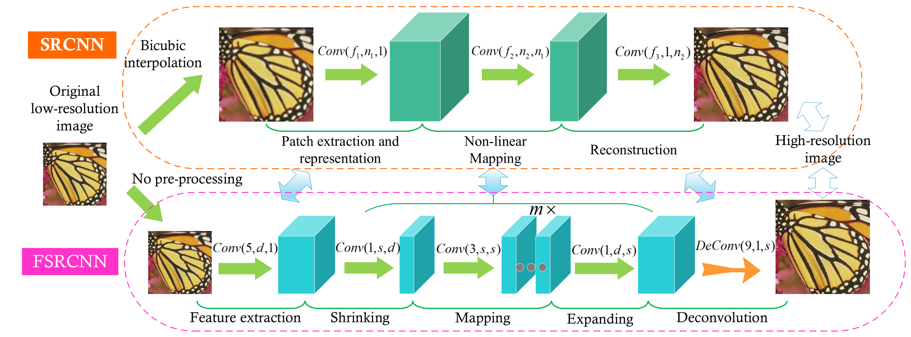
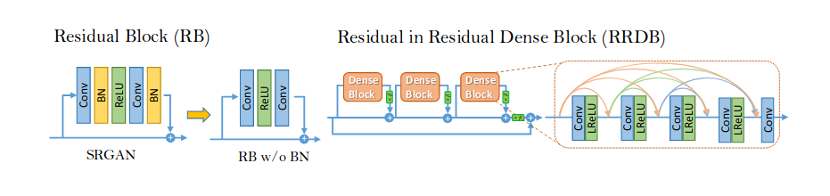

# Proba-v

PROBA-V is an earth observation satellite designed to map land cover and vegetation growth across the entire globe. It was launched on the 6th of May 2013 into a sun-synchronous orbit. It's payload sensors allow for almost global coverage (90%) per day, providing 300m resolution images(LR). PROBA-V also provides 100m "high resolution" images (HR), but at a lower frequency, of roughly every 5 days (dependent on the location). 
The goal of this article is to construct such high-resolution images by using more frequent low-resolution images. This process is known as Multi-image Super-resolution.
PROBA-V takes multiple images from the same patch, but originate from successive revisits over longer periods of time. Thus, PROBA-Vs products represent a convenient way to explore super-resolution in a relevant setting. The images provided are not artificially degraded but are real images recorded from the very same scene, just at different resolutions and different times. Any improvements on this data-set might be transferable to larger collections of remote sensing data without the need to deploy more expensive sensors or satellites, as resolution enhancement can happen post-acquisition.

## Data

The data is collected satellite data from the PROBA-V mission in 74 regions around the globe at different points in time. The data is composed of radiometrically and geometrically corrected Top-Of-Atmosphere (TOA) reflectances for the RED and NIR spectral bands at 300m and 100m resolution in Plate Carrée projection. The 300m resolution (LR) data is delivered as 128x128 grey-scale pixel images, the 100m resolution (HR) data as 384x384 grey-scale pixel images.
Each image comes with a quality map, indicating which pixels in the image are concealed (i.e. clouds, cloud shadows, ice, water, missing, etc) and which should be considered clear. Each data-point consists of exactly one high-resolution image and several low-resolution images from the same scene. In total, the dataset contains 1450 scenes, which are split into 1160 scenes for training and 290 scenes for testing. On average, each scene comes with 19 different low resolution images and always with at least 9.

## Metric

To compare the quality of each super-resolution method, a modifier clear Peak Signal to Noise Ratio is used. To calculate the score, we calculate the bias of the brightness which is the mean difference between the cropped HR images and the cropped submitted image SR. This bias is used to calculate the corrected clear mean square error of the SR and HR images. After that, we calculate the clear Peak Signal to Noise Ratio and deduce the score which is the baseline cPSNR divided by the cPSNR. see competition [website](https://kelvins.esa.int/proba-v-super-resolution/scoring/) for all equations

## Approaches

Many approaches were used to solve the multi-image super-resolution (MISR)

### 1- Bicubic transformation
we construct the high-resolution image by aggregating low-resolution images pixel-wise. The functions used are mean, median and mode. We aggregate only clear pixels by using the quality map of each image. After that, we applied the bicubic transformation. This method was close to the baseline upscaling method used in this competition and gave us a score of 1.0036.

### 2- SRCNN
we implemented the SRCNN from Chao Dong et al (2015) article. It is a deep convolutional network that learns an end-to-end mapping between the LR images and HR images. This model takes the upscaled LR images as input and outputs an SR image. The model that we used has the following architecture:
    - a Conv2D with 32 filters, 9x9 kernel, ReLU activation function
    - a Conv2D with 32 filters, 3x3 kernel, ReLU activation function
    - a Conv2D with 64 filters, 3x3 kernel, ReLU activation function 
    - a Conv2D with 128 filters, 3x3 kernel, ReLU activation function 
    - a Conv2D with 64 filters, 3x3 kernel, ReLU activation function 
    - a Conv2D with 32 filters, 5x5 kernel, ReLU activation function 
    - a Conv2D with 1 filter, 5x5 kernel, Sigmoid activation function
The LR images were upscaled using the baseline upscaling function which average images with maximum clarity and uses bicubic interpolation.
To train this model, we used the PSNR as a loss function and Adam optimizer with a learning rate of 0.001 and beta_1 of 0.9.
After training the model for 130 epochs, we’ve got a score of 1.2257 which is worse than the baseline, which means that the model wasn’t trained for enough epochs.
The SRCNN takes as input the upscaled image, which increases the computational cost which made it very slow especially since it was trained on CPU ( I don’t have a GPU) and to have an acceptable result, it should be trained for a big number of epochs.
To address this problem, we applied the FSRCNN

### 3- FSRCNN
FSRCNN stands for Fast Super Resolution Convolutional Neural Network. It’s objective is resorting quality and increasing speed. Fig 1 shows the network structure of SRCNN and FSRCNN. The main advantages of FSRCNN over SRCNN are as fellow:
- using deconvolution layer at the end of the network instead of the bicubic transformation
- learning the mapping directly from the low-resolution image which decreases the computational cost
- using smaller kernel sizes and more mapping layers
- shrinking the input feature dimension before mapping

since FSRCNN is used for single image super-resolution, we used two approaches to combine the different pictures. The first approach is to aggregate all LR images using the median of each pixel so to end up with a (128,128,1) input image. The second approach is to concatenate the 9 LR images with the maximum number of clear pixels, so the input image for the network is of size (128,128,9)
The structure used for FSRCNN is as  follow:

- feature block with 1 Conv2D layer with 32 filters, 5x5 kernel and 1x1 stride size and a PReLU activation layer.
- shrinkage block with 1 Conv2D layer with 32 filters, 1x1 kernel and 1x1 stride size and a PReLU activation layer.
- mapping block with 4 Conv2D layers with 32 filters, 3x3 kernel and 1x1 stride size and a PReLU activation layer.
- expanding block with 1 Conv2D layer with 32 filters, 5x5 kernel and 1x1 stride size and a PReLU activation layer.
- deconvolution block with 1 deconvolution layer with 1 filter, 9x9 kernel and 3x3 stride size.
The model with the aggregated images as input was trained for 300 epochs, with the MSE as the loss and Adam optimizer. After using the model for prediction we received a score of 1.225734
The model with the concatenated images as input was trained for 150 epochs,   PSNR as the loss function and Adam optimizer. After constructing the SR images we received a score of 1.2179. which is slightly better than the previous one. (Train the model for 150 epochs is not enough)

### 4- SRGAN
Next, we applied a modified version of Super Resolution GAN. This model was developed by Christian Ledig et al (2017) in their article entitled Photo-Realistic Single Image Super-Resolution Using a Generative Adversarial Network. They used a perceptual loss function which consists of an adversarial loss and a content loss. The adversarial loss is used to train the discriminator network to differentiate between the SR images and HR images. In addition, they defined a new loss based on the high-level feature map of the VGG network.
Fig 2 shows the SRGAN architecture which is composed of a generator that generates images and a discriminator differentiate between true images and fake images.
For the Generator, we implemented the one used in Xintao et al (2018) in there article entitled  ESRGAN: Enhanced super-resolution generative adversarial networks were they improved the Generator by introducing the Residual-in-Residual Dense Block (RDDB), which is of higher capacity. They also remove Batch Normalization layers and use smaller initialization.

Fig 3 shows the residual block in ESRGAN
we implemented the modifier SRGAN using Keras library. The generator had the VGG loss which is the mean square difference of the feature representation on a convolutional layer in VGG19 between SR images and HR images. 
To use the VGG model, we should use images with 3 channels, or the image in our data has only one channel. To address this issue we concatenate the 3 most clearer LR images as input and we duplicate HR images as output.
even though we simplified SRGAN a lot, it was very slow because the size of the kernels was large, we don’t dispose of a GPU and the LR images used in this competition are bigger compared to the ones used by SRGAN developers. For the SRGAN to give a good result, it should be trained for more than 100000 iterations (ESRGAN developers trained the model for 300k iterations)
To address the issue of slowness, unavailability of GPU and memory shortage we implemented another model called LapSRN

### 5- LapSRN
LapSRN stands for Laplacian Pyramid Super Resolution Network, it was developed by Wei-Sheng Lai et al (2017). this model progressively reconstructs the sub band residuals of high-resolution images. At each pyramid level, the model takes coarse-resolution feature maps as input, predicts the high-frequency residuals, and uses transposed convolutions for upsampling to the finer level. it dramatically reduces the computational complexity. Fig 4 shows the LapSRN architecture. this model uses the Charbonnier loss function

LapSRN progressively predicts residual images at log2(S) levels where S is the scale factor. Since we need to upscale our LR images by a factor of 3, we can’t directly use this model. If we upscale directly to 3X, the resulting model will be too simple and we won’t take advantage of the shared upscaled images from different scales. So in our case, we upscaled till level 4 and we downscale to level 3. for Downscaling we used a Lambda layer with a resize function.
We trained this model for 500 epochs, using charbonnier loss and Adam optimizer. we have got a score of 1.22577. 
After that we trained the model for 1000 epochs using the PSNR loss, we have got a score of 1.05.

## Conclusion

The proba-v super-resolution was a challenging problem. First, because of its special data, since each image has a quality map that should be taken into consideration. Also, the image size is large which adds computational cost to the models. Second, because of its special metrics that calculate the loss on the cropped images. In our modelization, we didn’t crop the image, it would be better to try it and compare the results.  Third, this problem needs a powerful GPU and a long time to train. For example, in my case to train SRGAN for 1000 epochs using a computer with 7.7 GiB RAM Intel® Core™ i7-4702MQ CPU @ 2.20GHz × 8 I need more than 12 days.
To combine different images we used aggregate function pixel wise, but other approaches should be applied and tested, but due to the lack of time, we didn’t have the chance.
For example, use a multi-input model were we input simultaneously the images and the quality map. 
In the other hand, since the data is images of the same scene taken at different points in time, we could think of is as sequence data and use Recurrent Neural Network before using convolutional Neural Network.
